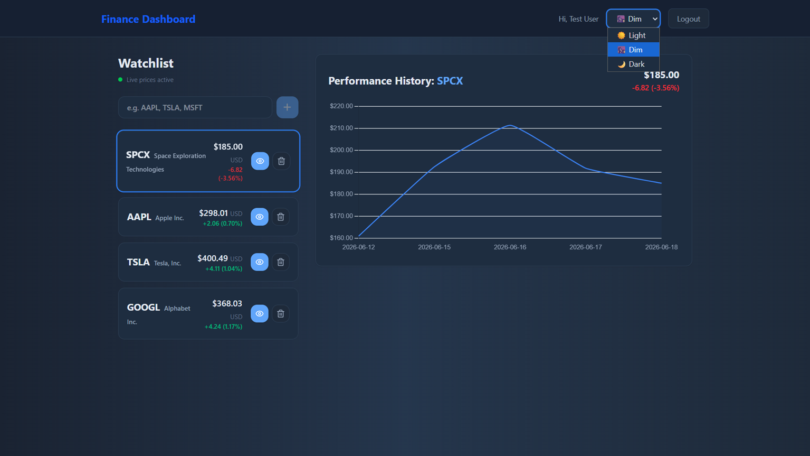
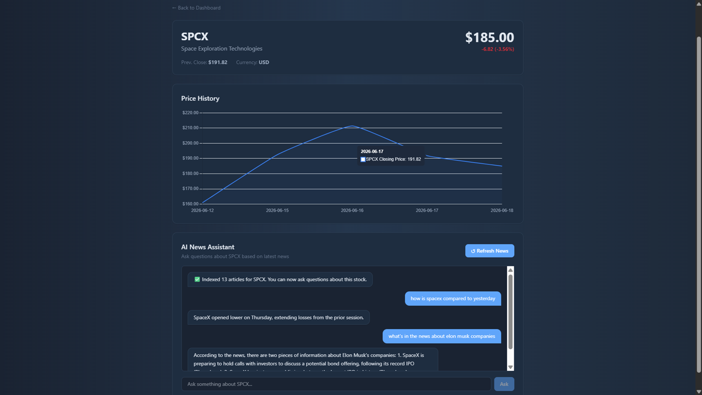

# Finance Dashboard


An AI-powered financial intelligence platform. Track stocks, monitor live prices via WebSocket streaming, and ask natural language questions about any stock grounded in real financial news — powered by a RAG pipeline built with LangChain, Groq, and pgvector.

---

## Table of Contents

- [Features](#features)
- [Screenshots](#screenshots)
- [Architecture](#architecture)
- [Tech Stack](#tech-stack)
- [Getting Started](#getting-started)
- [API Endpoints](#api-endpoints)
- [Testing](#testing)
- [CI/CD Pipeline](#cicd-pipeline)
- [Project Structure](#project-structure)
- [Future Improvements](#future-improvements)

---

## Features

- **JWT Authentication** — Secure per-user data with token-based auth (register, login, logout)
- **Stock Watchlist** — Add and remove stocks with symbol validation before insertion
- **Live Price Streaming** — WebSocket connection pushes price updates every 30 seconds with a live connection indicator
- **Interactive Price Chart** — Click any stock to view its price history chart rendered with Chart.js
- **Stock Detail Page** — Dedicated page per stock with full quote info, price history, and AI chat
- **RAG AI News Assistant** — Ask natural language questions about any stock grounded in real financial news
- **Dual News Sources** — News fetched from both Marketaux API and yfinance, merged and deduplicated before embedding
- **pgvector Semantic Search** — News articles embedded with FastEmbed and stored in PostgreSQL pgvector for similarity retrieval
- **Groq LLM Answers** — Retrieved context passed to Llama 3.1 via Groq API for fast, grounded responses
- **Theme Switcher** — Light, Dim, and Dark modes powered by CSS custom properties, persisted across sessions
- **REST API** — Clean FastAPI backend with Swagger docs at `/docs`
- **Alembic Migrations** — Database schema managed with versioned migrations
- **React Query** — Server state managed with TanStack Query for caching, deduplication, and automatic refetching

---

## Screenshots

### Dashboard — Dim Mode


### Stock Detail & AI News Assistant — Dim Mode


---

## Architecture

```
┌─────────────────┐   HTTP/WS     ┌─────────────────┐     SQLAlchemy    ┌──────────────────┐
│  React Frontend │ ────────────► │  FastAPI Backend │ ────────────────► │  PostgreSQL 16   │
│   (Port 5173)   │               │   (Port 8000)    │                   │  + pgvector ext  │
│                 │ ◄──────────── │                  │                   └──────────────────┘
│  useStockPrices │   WS push     │  /ws/prices      │
│  (WS hook)      │   every 30s   │  (price stream)  │
└─────────────────┘               └─────────────────┘
                                          │
                          ┌───────────────┼───────────────┐
                          ▼               ▼               ▼
                   ┌─────────────┐ ┌──────────┐ ┌─────────────────┐
                   │  yfinance   │ │Marketaux │ │   Groq API      │
                   │  (quotes +  │ │  (news   │ │ (Llama 3.1 LLM) │
                   │   history)  │ │articles) │ └─────────────────┘
                   └─────────────┘ └──────────┘
                          │               │
                          └───────┬───────┘
                                  ▼
                         ┌─────────────────┐
                         │   FastEmbed     │
                         │  (embeddings)   │
                         └────────┬────────┘
                                  ▼
                         ┌─────────────────┐
                         │    pgvector     │
                         │ (vector store)  │
                         └─────────────────┘
```

### RAG Pipeline

```
User Question
     │
     ▼
Embed Question (FastEmbed)
     │
     ▼
Similarity Search → pgvector (top 4 chunks)
     │
     ▼
Build Prompt (question + retrieved news context)
     │
     ▼
Groq API (Llama 3.1) → Answer grounded in real news
```

### WebSocket Price Streaming

```
Client connects → ws://localhost:8000/ws/prices?token=<jwt>
     │
     ▼
Backend authenticates token → fetches user watchlist
     │
     ▼
Every 30s → fetches quotes for all watchlist symbols concurrently
     │
     ▼
Pushes JSON price updates → frontend merges with cached data
```

---

## Tech Stack

| Layer | Technology |
|-------|------------|
| Frontend | React 18, TypeScript, Vite, Tailwind CSS v4, Chart.js, React Router, TanStack Query |
| Backend | Python 3.12, FastAPI, SQLAlchemy 2.0 async, asyncpg, WebSockets |
| Database | PostgreSQL 16 with pgvector extension |
| AI / RAG | LangChain, FastEmbed, pgvector, Groq API (Llama 3.1) |
| News Sources | Marketaux API, yfinance |
| Auth | JWT (python-jose), bcrypt |
| Migrations | Alembic |
| Infrastructure | Docker, Docker Compose, GitHub Container Registry (GHCR) |
| CI/CD | GitHub Actions (ruff, pytest, coverage, Docker builds, Trivy scanning) |
| Testing | Pytest, pytest-cov (16 tests, 50%+ coverage enforced) |

---

## Getting Started

### Prerequisites

- Docker Desktop
- A free [Marketaux API key](https://marketaux.com)
- A free [Groq API key](https://console.groq.com)

### Option A — Full Docker Setup (recommended)

```bash
git clone https://github.com/Iskandar-Mhadhbi/finance-dashboard.git
cd finance-dashboard

# Copy and configure environment file
cp backend/.env.example backend/.env

# Add your secrets to backend/.env:
# - JWT_SECRET
# - MARKETAUX_API_KEY
# - GROQ_API_KEY

# Build and start everything
docker-compose up -d --build

# Run migrations
docker-compose exec backend alembic upgrade head
```

| Service | URL |
|---------|-----|
| Frontend | http://localhost |
| Backend API | http://localhost:8000 |
| Swagger Docs | http://localhost:8000/docs |

### Option B — Local Development

```bash
# Start PostgreSQL only
docker-compose up postgres -d

# Backend
cd backend
python -m venv venv
venv\Scripts\activate        # Windows
pip install -r requirements.txt
alembic upgrade 5065984fa4f0
alembic upgrade ff4a3492c91a
# (Start the app here once, then run the final step)
alembic upgrade 6296bdb69a39
uvicorn main:app --reload

# Frontend (new terminal)
cd frontend
npm install
npm run dev
```

| Service | URL |
|---------|-----|
| Frontend | http://localhost:5173 |
| Backend API | http://localhost:8000 |
| Swagger Docs | http://localhost:8000/docs |

---

## API Endpoints

### Auth
| Method | Endpoint | Description | Auth |
|--------|----------|-------------|------|
| POST | `/api/auth/register` | Register new user | ❌ |
| POST | `/api/auth/login` | Login | ❌ |
| GET | `/api/auth/me` | Get current user | ✅ |

### Stocks
| Method | Endpoint | Description | Auth |
|--------|----------|-------------|------|
| GET | `/api/stocks/{symbol}/quote` | Live price quote | ✅ |
| GET | `/api/stocks/{symbol}/history` | Price history | ✅ |

### Watchlist
| Method | Endpoint | Description | Auth |
|--------|----------|-------------|------|
| GET | `/api/watchlist` | Get user's watchlist | ✅ |
| POST | `/api/watchlist` | Add stock (validates symbol) | ✅ |
| DELETE | `/api/watchlist/{id}` | Remove from watchlist | ✅ |

### RAG AI
| Method | Endpoint | Description | Auth |
|--------|----------|-------------|------|
| POST | `/api/rag/{symbol}/fetch` | Fetch & embed latest news | ✅ |
| POST | `/api/rag/{symbol}/ask` | Ask a question about a stock | ✅ |

### WebSocket
| Protocol | Endpoint | Description | Auth |
|----------|----------|-------------|------|
| WS | `/ws/prices?token=<jwt>` | Live price stream for watchlist | ✅ |

---

## Testing

```bash
cd backend

# Run unit tests
pytest tests/ -v

# Run with coverage report
pytest tests/ --cov=app --cov-report=html --cov-report=term
```

**Test suites:** 3 | **Tests:** 16 passing | **Coverage:** Services 100%

---

## CI/CD Pipeline

Every push to `develop` or `main` triggers a 4-stage pipeline:

```
Lint (ruff) + Tests (pytest + coverage ≥ 50%)
      │
      ├── Build Backend Image ── Trivy Security Scan
      └── Build Frontend Image ── Trivy Security Scan
```

| Job | Trigger | Description |
|-----|---------|-------------|
| Tests | Every push | ruff linting + pytest + HTML coverage artifact |
| Build Backend | After tests pass | Docker image built, pushed to GHCR on `main` |
| Build Frontend | After tests pass | Docker image built, pushed to GHCR on `main` |
| Trivy Scan | After builds | Vulnerability scan on CRITICAL/HIGH severity |

Docker images published to GitHub Container Registry:
- `ghcr.io/iskandar-mhadhbi/finance-dashboard/backend:latest`
- `ghcr.io/iskandar-mhadhbi/finance-dashboard/frontend:latest`

---

## Project Structure

```
finance-dashboard/
├── backend/
│   ├── main.py                     # FastAPI app entry point
│   ├── requirements.txt
│   ├── alembic.ini
│   ├── alembic/                    # Database migrations
│   ├── tests/                      # Pytest unit tests
│   └── app/
│       ├── core/                   # Config, database, security, deps
│       ├── models/                 # SQLAlchemy models (User, Watchlist)
│       ├── schemas/                # Pydantic schemas
│       ├── routers/                # API route handlers
│       │   ├── api.py              # Aggregated router
│       │   ├── auth.py
│       │   ├── stocks.py
│       │   ├── watchlist.py
│       │   ├── rag.py
│       │   └── ws.py               # WebSocket price streaming
│       └── services/               # Business logic
│           ├── auth_service.py
│           ├── stock_service.py
│           ├── watchlist_service.py
│           └── rag_service.py      # RAG pipeline
├── frontend/
│   └── src/
│       ├── api/                    # Axios API clients
│       ├── components/             # Reusable UI components
│       ├── context/
│       │   ├── auth/               # AuthContext, useAuth, auth-context
│       │   └── theme/              # ThemeContext, useTheme, theme-context
│       ├── hooks/
│       │   └── useStockPrices.ts   # WebSocket hook
│       ├── pages/                  # Dashboard, StockDetail, Login, Register
│       └── main.tsx
├── .github/workflows/
│   └── ci.yml                      # GitHub Actions pipeline
├── docker-compose.yml
└── screenshots/
```

---

## Future Improvements

- [ ] Price alerts with threshold notifications
- [ ] AWS SQS + Lambda for event-driven alert delivery
- [ ] Deploy to Railway / Render with full CD pipeline
- [ ] E2E tests with Playwright
- [ ] Export watchlist to CSV
- [ ] Portfolio-style landing page

---

## License

MIT © [Iskandar Mhadhbi](https://github.com/Iskandar-Mhadhbi/finance-dashboard)
