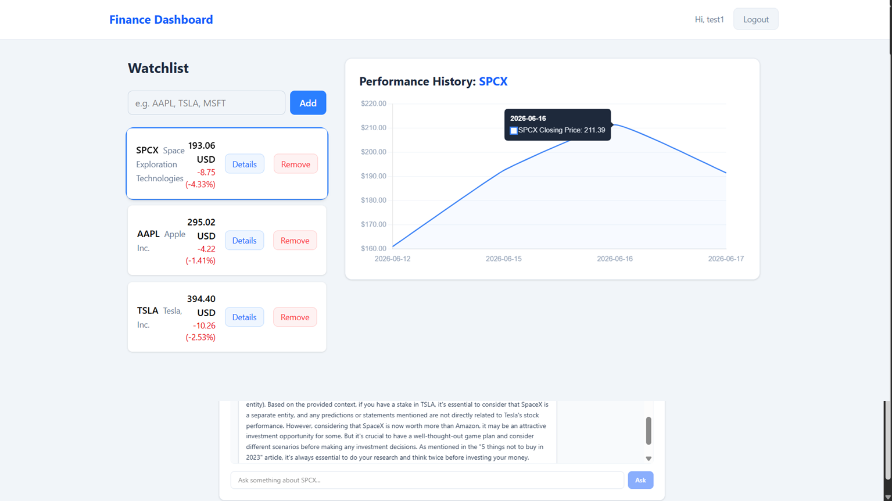
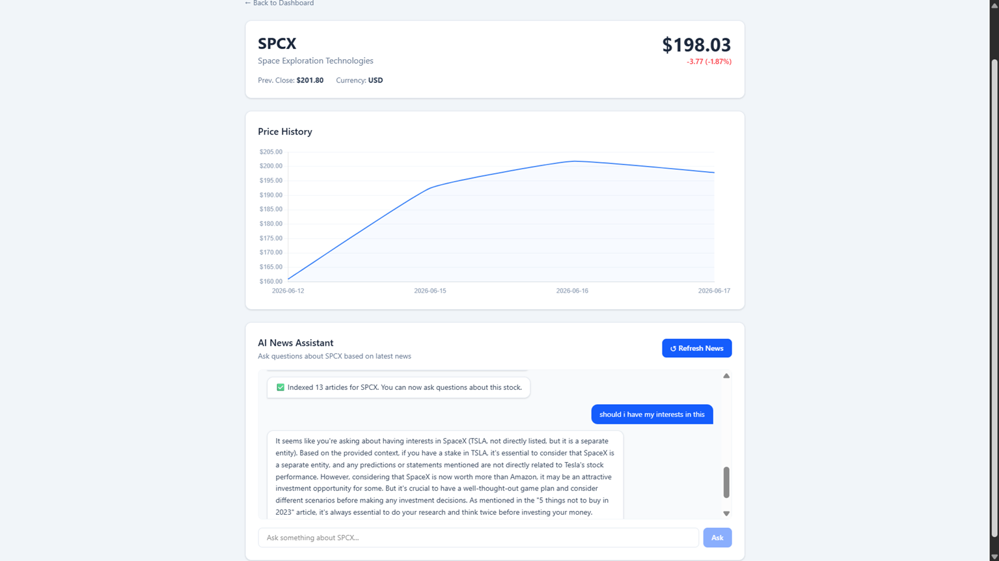

# Finance Dashboard


An AI-powered financial intelligence platform. Track stocks, monitor live prices, and ask natural language questions about any stock grounded in real financial news — powered by a RAG pipeline built with LangChain, Groq, and pgvector.

---

## Table of Contents

- [Features](#features)
- [Screenshots](#screenshots)
- [Architecture](#architecture)
- [Tech Stack](#tech-stack)
- [Getting Started](#getting-started)
- [API Endpoints](#api-endpoints)
- [Project Structure](#project-structure)
- [Future Improvements](#future-improvements)

---

## Features

- **JWT Authentication** — Secure per-user data with token-based auth (register, login, logout)
- **Stock Watchlist** — Add and remove stocks, with live price quotes fetched via yfinance
- **Live Price Dashboard** — Watchlist with real-time price, change, and percentage displayed per stock
- **Interactive Price Chart** — Click any stock to view its price history chart rendered with Chart.js
- **Stock Detail Page** — Dedicated page per stock with full quote info and price history
- **RAG AI News Assistant** — Ask natural language questions about any stock grounded in real financial news
- **Dual News Sources** — News fetched from both Marketaux API and yfinance, merged and deduplicated before embedding
- **pgvector Semantic Search** — News articles embedded with FastEmbed and stored in PostgreSQL pgvector for similarity retrieval
- **Groq LLM Answers** — Retrieved context passed to Llama 3.1 via Groq API for fast, grounded responses
- **REST API** — Clean FastAPI backend with Swagger docs at `/docs`
- **Alembic Migrations** — Database schema managed with versioned migrations

---

## Screenshots

### Dashboard


### Stock Detail & AI News Assistant


---

## Architecture

```
┌─────────────────┐     HTTP      ┌─────────────────┐     SQLAlchemy    ┌──────────────────┐
│  React Frontend │ ────────────► │  FastAPI Backend │ ────────────────► │  PostgreSQL 16   │
│   (Port 5173)   │               │   (Port 8000)    │                   │  + pgvector ext  │
└─────────────────┘               └─────────────────┘                   └──────────────────┘
                                          │
                          ┌───────────────┼───────────────┐
                          ▼               ▼               ▼
                   ┌─────────────┐ ┌──────────┐ ┌─────────────────┐
                   │  yfinance   │ │Marketaux │ │   Groq API      │
                   │  (quotes +  │ │  (news   │ │ (Llama 3.1 LLM) │
                   │   history)  │ │articles) │ └─────────────────┘
                   └─────────────┘ └──────────┘
                          │               │
                          └───────┬───────┘
                                  ▼
                         ┌─────────────────┐
                         │   FastEmbed     │
                         │  (embeddings)   │
                         └────────┬────────┘
                                  ▼
                         ┌─────────────────┐
                         │    pgvector     │
                         │ (vector store)  │
                         └─────────────────┘
```

### RAG Pipeline

```
User Question
     │
     ▼
Embed Question (FastEmbed)
     │
     ▼
Similarity Search → pgvector (top 4 chunks)
     │
     ▼
Build Prompt (question + retrieved news context)
     │
     ▼
Groq API (Llama 3.1) → Answer grounded in real news
```

---

## Tech Stack

| Layer | Technology |
|-------|------------|
| Frontend | React 18, TypeScript, Vite, Tailwind CSS v4, Chart.js, React Router |
| Backend | Python 3.12, FastAPI, SQLAlchemy 2.0 async, asyncpg |
| Database | PostgreSQL 16 with pgvector extension |
| AI / RAG | LangChain, FastEmbed, pgvector, Groq API (Llama 3.1) |
| News Sources | Marketaux API, yfinance |
| Auth | JWT (python-jose), bcrypt |
| Migrations | Alembic |
| Infrastructure | Docker, Docker Compose |

---

## Getting Started

### Prerequisites

- Docker Desktop
- A free [Marketaux API key](https://marketaux.com)
- A free [Groq API key](https://console.groq.com)

### Setup

```bash
git clone https://github.com/Iskandar-Mhadhbi/finance-dashboard.git
cd finance-dashboard

# Copy and configure environment file
cp backend/.env.example backend/.env

# Add your secrets to backend/.env:
# - JWT_SECRET
# - MARKETAUX_API_KEY
# - GROQ_API_KEY

# Start PostgreSQL
docker-compose up postgres -d

# Run backend migrations
cd backend
python -m venv venv
venv\Scripts\activate        # Windows
pip install -r requirements.txt
alembic upgrade head
uvicorn main:app --reload

# In a new terminal, start frontend
cd frontend
npm install
npm run dev
```

| Service | URL |
|---------|-----|
| Frontend | http://localhost:5173 |
| Backend API | http://localhost:8000 |
| Swagger Docs | http://localhost:8000/docs |

---

## API Endpoints

### Auth
| Method | Endpoint | Description | Auth |
|--------|----------|-------------|------|
| POST | `/api/auth/register` | Register new user | ❌ |
| POST | `/api/auth/login` | Login | ❌ |
| GET | `/api/auth/me` | Get current user | ✅ |

### Stocks
| Method | Endpoint | Description | Auth |
|--------|----------|-------------|------|
| GET | `/api/stocks/{symbol}/quote` | Live price quote | ✅ |
| GET | `/api/stocks/{symbol}/history` | Price history (OHLCV) | ✅ |

### Watchlist
| Method | Endpoint | Description | Auth |
|--------|----------|-------------|------|
| GET | `/api/watchlist` | Get user's watchlist | ✅ |
| POST | `/api/watchlist` | Add stock to watchlist | ✅ |
| DELETE | `/api/watchlist/{id}` | Remove from watchlist | ✅ |

### RAG AI
| Method | Endpoint | Description | Auth |
|--------|----------|-------------|------|
| POST | `/api/rag/{symbol}/fetch` | Fetch & embed latest news for a stock | ✅ |
| POST | `/api/rag/{symbol}/ask` | Ask a question about a stock | ✅ |

---

## Project Structure

```
finance-dashboard/
├── backend/
│   ├── main.py                     # FastAPI app entry point
│   ├── requirements.txt
│   ├── alembic.ini
│   ├── alembic/                    # Database migrations
│   └── app/
│       ├── core/                   # Config, database, security, deps
│       ├── models/                 # SQLAlchemy models (User, Watchlist)
│       ├── schemas/                # Pydantic schemas
│       ├── routers/                # API route handlers
│       │   ├── api.py              # Aggregated router
│       │   ├── auth.py
│       │   ├── stocks.py
│       │   ├── watchlist.py
│       │   └── rag.py
│       └── services/               # Business logic
│           ├── auth_service.py
│           ├── stock_service.py
│           ├── watchlist_service.py
│           └── rag_service.py      # RAG pipeline (fetch → embed → retrieve → answer)
├── frontend/
│   └── src/
│       ├── api/                    # Axios API clients
│       ├── components/             # Reusable UI components
│       ├── context/                # Auth context
│       ├── pages/                  # Dashboard, StockDetail, Login, Register
│       └── main.tsx
├── docker-compose.yml              # PostgreSQL + pgvector
└── screenshots/
```

---

## Future Improvements

- [ ] WebSocket real-time price updates
- [ ] Price alerts with AWS SQS + Lambda notifications
- [ ] Docker Compose full stack (backend + frontend containers)
- [ ] GitHub Actions CI/CD pipeline
- [ ] Pytest unit tests with coverage report
- [ ] Deploy to Railway / Render
- [ ] Portfolio-style landing page
- [ ] Export watchlist to CSV

---

## License

MIT © [Iskandar Mhadhbi](https://github.com/Iskandar-Mhadhbi/finance-dashboard)